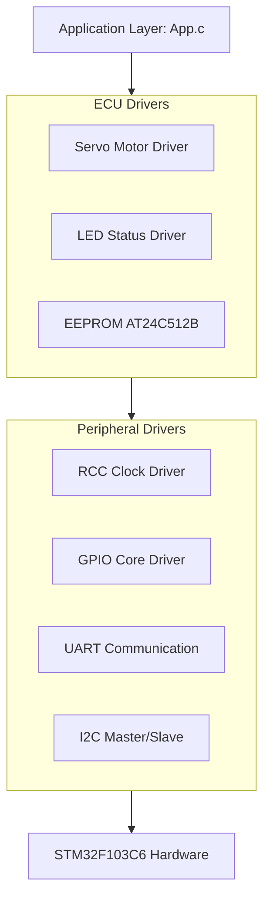
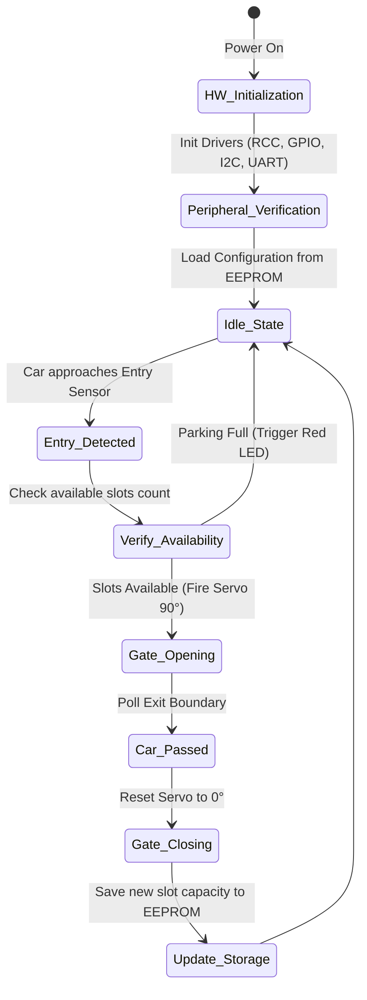

# 🚗 Smart Car Parking System (STM32F103)

[](https://st.com)
[]()
[]()
[](LICENSE)

An advanced, highly modular Embedded Systems project designed to automate and manage a smart car parking lot using the **STM32F103C6** (ARM Cortex-M3) microcontroller. The system features dynamic gate control, non-volatile state logging, and safe peripheral drivers written completely from scratch (MCAL/ECUAL layered architecture).

---

## 📸 System Overview & Circuit

### System Hardware Architecture
Below is the hardware connections and interfacing schematic for the parking system peripherals:

<p align="center">
  
</p>

---

## 🏗️ Architectural Layering (MCAL & ECUAL)

The firmware is designed using a strictly layered architecture to decouple upper application logic from low-level hardware registers, maximizing code reusability.



---

## ⚙️ Core Peripheral Specifications (MCAL)

### 1. RCC Clock Driver (`RCC.c` / `RCC.h`)
Manages the internal/external clock distribution system. It includes internal tables to decode prescalers dynamically:
* **Clock Sources Support:** HSI ($16\text{ MHz}$) and HSE ($8\text{ MHz}$).
* **Dynamic APIs:**
  * `RCC_GetSYS_CLCKFreq()`: Dynamically parses `RCC->CFGR` to determine system source.
  * `RCC_Get_HCLCKFreq()`: Resolves AHB bus frequency via `AHBPrescTable`.
  * `RCC_Get_PCLK1Freq()` / `RCC_Get_PCLK2Freq()`: Calculates APB1/APB2 low/high speed clock domains dynamically for precise baudrate generation.

### 2. GPIO Driver (`GPIO.c` / `GPIO.h`)
Handles pin configurations, atomic state manipulation, and multi-mode support (Output Open-Drain, Output Push-Pull, Input Pull-Up/Down).
* **Safe Architecture:** Includes automatic type handling with strict warning-free pointer registers.

### 3. UART Driver (`UART.c` / `UART.h`)
Asynchronous serial communication used for real-time logging, user telemetry, and debugging.
* Auto-calculates Baudrate using the live `RCC_Get_PCLKxFreq()` outputs.

### 4. I2C Driver (`I2C.c` / `I2C.h`)
Custom implementation of the Inter-Integrated Circuit protocol to handle Master/Slave operations.
* **Safety Integration:** Strict signature typing matching `const uint8_t *pData` parameters on transmission bounds to prevent accidental memory modification during communication.

---

## 🎛️ Actuators & Components Layer (ECUAL)

| Component | Interface / Protocol | Purpose |
| :--- | :--- | :--- |
| **Servo Motors** | PWM via Timer/GPIO | Rotates dynamically ($0^{\circ}$ to $90^{\circ}$) to command Entry and Exit gates. |
| **EEPROM AT24C512B** | I2C Protocol | Stores real-time available parking slots configuration into a non-volatile safe sector. |
| **LED Indicators** | Digital GPIO Output | Provides live visual cues for gate accessibility status (Active High / Active Low flexible configurations). |

---

## 📊 Application Flow Chart

The system operates based on deterministic event polling and structural state flags. The execution loop lifecycle proceeds as follows:

<p align="center">
  
</p>

### Detailed Event Execution State


---

## 🚀 Getting Started & Build Instructions

### Prerequisites
* **Development Environment:** [STM32CubeIDE](https://st.comen/development-tools/stm32cubeide.html) (Tested on Version 2.0.0+)
* **Toolchain:** `arm-none-eabi-gcc` (v13.3.1)
* **Hardware Setup:** STM32F103C6 Dev Board (BluePill) + ST-Link V2 Debugger.

### Compiling from Source
1. Clone the repository into your workspace directory:
   ```bash
   git clone https://github.com
   ```
2. Open STM32CubeIDE, choose **File -> Import -> Existing Projects into Workspace** and select the cloned directory.
3. Clean the project to ensure object list consistency:
   `Project -> Clean...`
4. Trigger the GNU Make compiler using the **Build (Hammer Icon)** or via shortcut `Ctrl + B`.
5. The build chain outputs can be verified in the Console tab:
   ```bash
   arm-none-eabi-gcc -gdwarf-2 -o "Full_Project_2.elf" @"objects.list" -mcpu=cortex-m3 ...
   Build Finished. 0 errors, 0 warnings.
   ```

---

## 🛠️ Future Roadmap Enhancements
- [ ] Integration of a custom lightweight RTOS Scheduler for task management.
- [ ] Adding an LCD / 16x2 Display Driver over I2C to show active free slots metrics.
- [ ] Priority handling on concurrent gate interruptions.

---

## 📄 License
This project is licensed under the MIT License - see the [LICENSE](LICENSE) file for details.

---

## 👨‍💻 Author
**Mahmoud Saleh**
* Embedded Systems Engineer
* [GitHub Profile](https://github.com)
* [LinkedIn Profile](https://linkedin.com)
