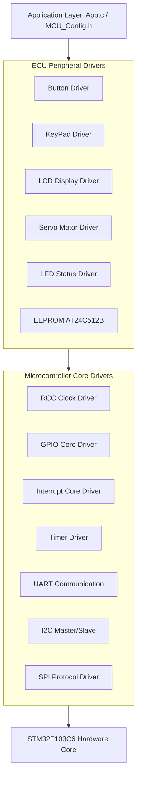
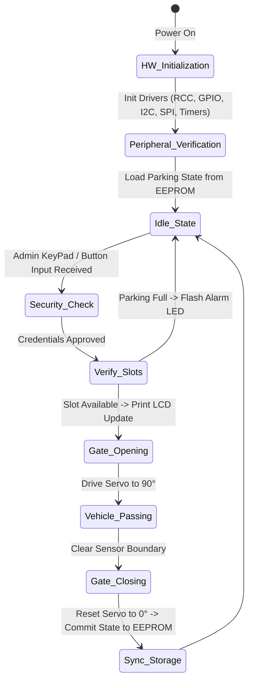

# 🚗 Smart Car Parking System (STM32F103)

<p align="left">
  
  
  
  
  
</p>

An advanced, highly modular Embedded Systems project designed to automate and manage a smart car parking lot using the **STM32F103C6** (ARM Cortex-M3) microcontroller. The system features dynamic gate control, non-volatile state logging, and safe peripheral drivers written completely from scratch (MCAL/ECUAL layered architecture).

---

## 📸 System Overview & Circuit

### System Hardware Architecture
Below is the hardware connections and interfacing schematic for the parking system peripherals:

<p align="center">
  
</p>

---

## 🏗️ Architectural Layering (Full System Breakdown)

The firmware is designed using a strictly decoupled, layered layered architecture to separate application logic from low-level register manipulations. Below is the comprehensive map of all modules included in the repository:



### 📂 Repository File Structure
```directory
├── Core/
│   ├── APP/
│   │   ├── App.c
│   │   └── MCU_Config.h
│   ├── ECUAL/
│   │   ├── Button_Driver/
│   │   ├── EEPROM_Driver/
│   │   ├── KeyPad_Driver/
│   │   ├── LCD_Driver/
│   │   ├── Led_Driver/
│   │   └── ServoMotor_Driver/
│   ├── MCAL/
│   │   ├── GPIO_Driver/
│   │   ├── I2C_Driver/
│   │   ├── Interrupt_Driver/
│   │   ├── RCC_Driver/
│   │   ├── SPI_Driver/
│   │   ├── Timer_Driver/
│   │   └── UART_Driver/
│   └── Utilities/
└── Docs/
    ├── Circuit.png
    └── ControlFlow-main.png
```

---

## ⚙️ Peripheral Integration Details (MCAL)

* **RCC Clock Driver:** Dynamically decodes `RCC->CFGR` to calculate system core frequencies ($16\text{ MHz}$ HSI / $8\text{ MHz}$ HSE), automatically adjustments clock propagation across AHB, APB1, and APB2 buses.
* **GPIO Core Driver:** Manages atomic bit manipulation and handles full custom mode configurations (Analog, Input Floating, Pull-Up/Down, Push-Pull, and Open-Drain outputs).
* **Interrupt Driver (EXTI):** Handles hardware event-triggered interrupts (such as sensor triggers or emergency bounds).
* **Timer Driver:** Generates hardware precise PWM outputs to drive gate positioning smoothly.
* **UART Driver:** Custom asynchronous communication module featuring automatic Baudrate calculation utilizing active bus frequency polling APIs.
* **I2C Driver:** Master/Slave protocol implementation optimized for byte-stream safety constraints, preventing runtime data corruption on transmission frames.
* **SPI Driver:** Custom synchronous serial peripheral interface designed for high-speed local data bus extensions.

---

## 🎛️ Human-Machine Interface & Actuators (ECUAL)

| Module Driver | Protocol / Connection | Architectural Function |
| :--- | :--- | :--- |
| **KeyPad Driver** | Matrix GPIO Scanning | Captures security passcodes and administrative gate override commands. |
| **LCD Display Driver** | Digital Parallel Interface | Renders live telemetry, available slot counts, and interactive system diagnostics. |
| **Button Driver** | Debounced GPIO Input | Acts as manual entry/exit request interfaces. |
| **Servo Motors** | Timer PWM Modulation | Direct mechanical operation of security entry and exit barriers ($0^{\circ}$ to $90^{\circ}$). |
| **EEPROM AT24C512B** | Master I2C Interface | Retains dynamic structural stats and logging states over non-volatile safe blocks. |
| **LED Indicators** | Configurable GPIO Output | Immediate physical visualization for Active-High / Active-Low barrier alerts. |

---

## 📊 Application Flow Chart

The system operates based on deterministic event polling and structural state flags. The execution loop lifecycle proceeds as follows:

<p align="center">
  
</p>

### Detailed Event Execution State


---

## 🚀 Getting Started & Build Instructions

### Prerequisites
* **Development Environment:** [STM32CubeIDE](https://st.com) (Tested on Version 2.0.0+)
* **Toolchain:** `arm-none-eabi-gcc` (v13.3.1)
* **Hardware Setup:** STM32F103C6 Dev Board (BluePill) + ST-Link V2 Debugger.

### Compiling from Source
1. Clone the repository into your workspace directory:
   ```bash
   git clone https://github.com
   ```
2. Open STM32CubeIDE, choose **File -> Import -> Existing Projects into Workspace** and select the cloned directory.
3. Clean the project to ensure object list consistency:
   `Project -> Clean...`
4. Trigger the GNU Make compiler using the **Build (Hammer Icon)** or via shortcut `Ctrl + B`.
5. The build chain outputs can be verified in the Console tab:
   ```bash
   arm-none-eabi-gcc -gdwarf-2 -o "Full_Project_2.elf" @"objects.list" -mcpu=cortex-m3 ...
   Build Finished. 0 errors, 0 warnings.
   ```

---

## 🛠️ Future Roadmap Enhancements
- [ ] Integration of a custom lightweight RTOS Scheduler for multi-tasking.
- [ ] Enhancing I2C handling via asynchronous non-blocking interrupts.
- [ ] Multi-zone tracking optimization algorithms.

---

## 📄 License
This project is licensed under the MIT License - see the [LICENSE](LICENSE) file for details.

---

## 👨‍💻 Author
**Mahmoud Saleh**
* Embedded Systems Engineer
* [GitHub Profile](https://github.com/Mahmoud976)
* [LinkedIn Profile](https://linkedin.com)
